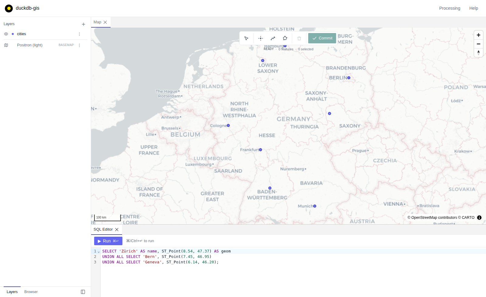

# duckdb-gis

A browser-based GIS built on DuckDB. `duckdb-gis` is a DuckDB **extension**
(C++) that starts a local HTTP server and serves a [MapLibre](https://maplibre.org/)
+ [deck.gl](https://deck.gl/) frontend, letting you explore and run spatial SQL
against your data on a map — QGIS-style, but with DuckDB as the engine.

The north star is to replicate QGIS's core workflows (Layers panel, Browser
panel, geoprocessing tools, feature selection) while keeping all compute
**native and local**: the extension runs the SQL and spatial work in-process,
in the same DuckDB instance — there is no remote backend.



This repository is a fork of [`duckdb/duckdb-ui`](https://github.com/duckdb/duckdb-ui).
It reuses that project's SQL-over-HTTP transport and TypeScript client, but
replaces the hosted UI with our own MapLibre frontend under `frontend/`.

## Install

> **Not yet listed.** The submission to
> [`duckdb/community-extensions`](https://github.com/duckdb/community-extensions)
> is still in progress, so the command below does not work yet. Until it lands,
> [build from source](#build-from-source).

```sql
INSTALL gis FROM community;
LOAD gis;
CALL start_gis();
```

`start_gis()` starts a local HTTP server and opens your browser. Everything it
serves — the frontend included — is compiled into the extension binary, so it
works offline and makes no outbound network requests.

The extension is named `gis`, which is distinct from DuckDB's own core `ui`
extension: `LOAD ui; LOAD gis;` can coexist in one session.

## What you get

- **Layers panel** — add any table or query with a geometry column as a map
  layer; reorder, toggle, style and zoom to it.
- **Browser panel** — walk the DuckDB catalog and add geometry-bearing tables
  to the map from a right-click menu.
- **SQL editor** — run spatial SQL and render the result set as a temporary
  layer.
- **Select features** — click features on the map to select the underlying rows.
- **Draw and edit** — digitize geometry into a working set, then commit it back
  into a native DuckDB table.

Spatial work uses DuckDB's `spatial` extension and runs in-process. There is no
remote backend and no data leaves your machine.

## Repository layout

- `src/` — the C++ extension (HTTP server, event dispatcher, settings, state).
  See `src/http_server.cpp` (`HttpServer::Run`) for the endpoints.
- `frontend/` — the MapLibre/deck.gl GIS frontend (React + Vite). This is the
  point of the fork.
- `ts/` — TypeScript packages shared with the frontend, notably
  `duckdb-ui-client` (the SQL-over-HTTP client). See `ts/README.md`.
- `test/sql/` — SQL-level extension tests.
- `tickets/` — the work board (see `tickets/README.md`).

## Build from source

The build is based on the [DuckDB extension template](https://github.com/duckdb/extension-template):

```sh
make
```

This produces:

```sh
./build/release/duckdb                                # DuckDB shell with the extension loaded
./build/release/test/unittest                         # test runner
./build/release/extension/gis/gis.duckdb_extension    # loadable extension binary
```

The extension is auto-loaded into the bundled `duckdb`/`unittest` binaries. The
extension name is `gis` (see `extension_config.cmake`) — distinct from
DuckDB's own core `ui` extension, so `LOAD ui; LOAD gis;` both work in the same
session.

The built frontend (`frontend/dist/`) is committed and compiled into the
extension binary as gzip-compressed byte arrays (see
`scripts/generate_embedded_assets.py` and the custom command in
`CMakeLists.txt`), so `make` alone never needs Node. If you change anything
under `frontend/src`, refresh the committed bundle first:

```sh
make frontend   # pnpm install && pnpm build in frontend/
make            # picks up the new frontend/dist automatically
```

CI (`.github/workflows/Frontend.yml`) fails the build if `frontend/dist` is
stale relative to `frontend/src`.

## Run

From SQL:

```sql
CALL start_gis();          -- start the server and open a browser
CALL start_gis_server();   -- start the server without opening a browser
FROM gis_is_started();     -- is the server running?
SELECT get_gis_url();      -- the local URL
CALL stop_gis_server();    -- stop the server
```

The DuckDB shell's `-ui` flag is hardcoded to call `start_ui()`, which this
extension deliberately does not register (that name belongs to DuckDB core's
`ui` extension — registering it too would collide). So `duckdb -ui` does not
launch the GIS UI; use `CALL start_gis();` above. To make `duckdb -ui` launch
this UI, put `.ui_command start_gis()` in your `~/.duckdbrc`.

## Frontend development

By default `CALL start_gis_server()` serves the frontend embedded in the
extension binary — no network access, works fully offline. During
development you'll want live reload instead: point the server at a Vite dev
server with hot-module reload, which proxies the SQL-over-HTTP API back to
the running extension. From `frontend/`:

```sh
pnpm install
pnpm dev        # Vite dev server on http://127.0.0.1:5173
```

Then start the extension shell **with `-unsigned`** — `gis_remote_url` is
gated behind `allow_unsigned_extensions`, which can only be set at startup,
not via `SET` once the database is running:

```sh
./build/release/duckdb -unsigned
```
```sql
SET gis_remote_url = 'http://localhost:5173';
CALL start_gis_server();   -- binds localhost:4214
```

Vite proxies `/ddb`, `/info`, and `/localEvents` to the extension server,
rewriting `Origin` so the extension's same-origin gate is satisfied (see
`frontend/vite.config.ts` and `src/http_server.cpp`). Other scripts:
`pnpm build`, `pnpm typecheck`.

## Architecture

The extension starts an HTTP server that both serves the frontend and handles
DuckDB operations. Requests to run SQL, interrupt runs, tokenize SQL, and
receive events (e.g. catalog updates) are exposed as HTTP endpoints — see
`HttpServer::Run` in [http_server.cpp](src/http_server.cpp).

Which assets the server serves is controlled by the `gis_remote_url` setting
(the DuckDB-UI mechanism we inherited). It defaults to empty, in which case
the server serves the frontend embedded in the binary — see
`HttpServer::HandleGetEmbedded` in `http_server.cpp`. Setting it to a URL
(e.g. the Vite dev server above) restores the original DuckDB-UI behavior of
proxying every GET to that origin.

The frontend talks to the server through the TypeScript
[duckdb-ui-client](ts/pkgs/duckdb-ui-client/package.json) package, which decodes
the binary result format. Spatial work is done with DuckDB's `spatial` extension
and rendered via GeoArrow deck.gl layers (`frontend/src/lib/deckRender.ts`);
tiled rendering uses `ST_AsMVT` (`frontend/src/lib/tiles.ts`).

## Versioning

Releases are tagged `vMAJOR.MINOR.PATCH` and versioned independently of DuckDB —
a release supports whichever DuckDB versions its CI matrix builds against (see
`.github/workflows/MainDistributionPipeline.yml`), rather than mirroring a
DuckDB version number.

Note that tags `v1.4.x` and `v1.5.x` in this repository predate the fork: they
are upstream `duckdb/duckdb-ui` releases, whose scheme tracked DuckDB versions.
Our own releases start at `v0.1.0`.

## License and attribution

MIT — see [LICENSE](LICENSE). The copyright notice is retained from upstream
`duckdb/duckdb-ui` (Stichting DuckDB Foundation), which this project is a fork
of and from which it inherits the extension scaffolding, the SQL-over-HTTP
transport, and the TypeScript client packages under `ts/`.

DuckDB is a trademark of the DuckDB Foundation. This project is an independent
fork and is not affiliated with, maintained by, or endorsed by the DuckDB
Foundation or DuckDB Labs. "duckdb-gis" is a descriptive name for a GIS
extension for DuckDB; it does not indicate official status.
